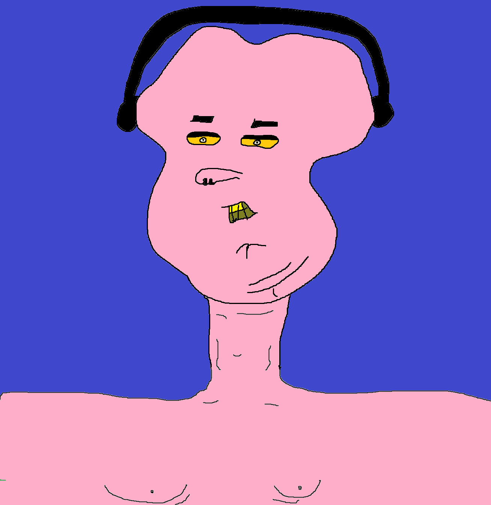

<p align="center">
  
</p>

# noobtube

A simple Discord bot that plays YouTube audio in voice channels.

## Features

- **Play** - Play YouTube videos (audio only) by URL or playlist link
- **Playlist Support** - Add entire YouTube playlists to the queue
- **Progress Bar** - See playback progress with `/nowplaying`
- **Pause/Resume** - Pause and resume playback
- **Skip** - Skip to the next song in queue
- **Queue** - View the current music queue
- **Now Playing** - See what's currently playing with progress
- **Stop** - Stop playback and clear the queue
- **Leave** - Make the bot leave the voice channel
- **Auto-Leave** - Bot leaves after 30 seconds of inactivity

## Prerequisites

- [Node.js](https://nodejs.org/) 18.0.0 or higher
- [FFmpeg](https://ffmpeg.org/) installed on your system
- [yt-dlp](https://github.com/yt-dlp/yt-dlp) installed on your system
- A Discord Bot Token (free)

---

## Setup Guide

### Step 1: Install System Dependencies

#### Install FFmpeg

**Windows (choose one):**
```bash
# Using Chocolatey
choco install ffmpeg

# Using winget
winget install ffmpeg
```

**Mac:**
```bash
brew install ffmpeg
```

**Linux:**
```bash
sudo apt install ffmpeg
```

#### Install yt-dlp

**Windows:**
```bash
pip install yt-dlp
```

**Mac:**
```bash
brew install yt-dlp
```

**Linux:**
```bash
sudo apt install yt-dlp
# or
pip install yt-dlp
```

---

### Step 2: Create a Discord Bot

1. Go to the [Discord Developer Portal](https://discord.com/developers/applications)
2. Click **"New Application"** and give it a name
3. Go to the **"Bot"** section in the left sidebar
4. Click **"Add Bot"** and confirm
5. **Copy the Bot Token** - click "Reset Token" if needed, then copy it (you'll need this later)
6. Scroll down and enable these **Privileged Gateway Intents**:
   - Server Members Intent
   - Message Content Intent
7. Save changes

---

### Step 3: Add the Bot to Your Discord Server

1. In the Developer Portal, go to **"OAuth2"** > **"URL Generator"**
2. Under **Scopes**, check:
   - `bot`
   - `applications.commands`
3. Under **Bot Permissions**, check:
   - Connect
   - Speak
   - Use Voice Activity
4. Copy the **Generated URL** at the bottom
5. Open the URL in your browser
6. Select your server and click **"Authorize"**

---

### Step 4: Install the Bot

```bash
git clone https://github.com/olympictechbro/noobtube.git
cd noobtube

npm install
```

---

### Step 5: Configure Environment Variables

1. Copy the example environment file:

**Windows:**
```bash
copy .env.example .env
```

**Mac/Linux:**
```bash
cp .env.example .env
```

2. Edit `.env` and add your credentials:

```env
DISCORD_TOKEN=your_bot_token_here
CLIENT_ID=your_client_id_here
```

**Where to find these values:**
- **DISCORD_TOKEN**: Discord Developer Portal > Your App > Bot > Token
- **CLIENT_ID**: Discord Developer Portal > Your App > General Information > Application ID

---

### Step 6: Run the Bot

```bash
npm start
```

You should see:
```
FFmpeg path: /path/to/ffmpeg
yt-dlp path: /path/to/yt-dlp
Logged in as YourBot#1234
Commands registered
```

---

## Commands

| Command | Description |
|---------|-------------|
| `/play <url>` | Play a YouTube video or playlist by URL |
| `/pause` | Pause the current song |
| `/resume` | Resume playback |
| `/skip` | Skip to the next song |
| `/queue` | Show the music queue |
| `/nowplaying` | Show current song with progress bar |
| `/stop` | Stop and clear queue |
| `/leave` | Leave voice channel |

## Usage Examples

```
# Play a single video
/play https://www.youtube.com/watch?v=dQw4w9WgXcQ

# Play an entire playlist
/play https://www.youtube.com/watch?v=UWcBtHdPSKk&list=PL6ccGtegsmFKlNOHYC7bFYeR4zWPgeIvB

/pause
/resume
/skip
/queue
/nowplaying
```

---

## Troubleshooting

### Bot joins but no audio plays
- Make sure FFmpeg is installed and in your PATH
- Make sure yt-dlp is installed and up to date: `pip install --upgrade yt-dlp`
- Check the console for error messages

### "Cannot find module" errors
- Run `npm install` again
- Make sure you're using Node.js 18+

### Slash commands not appearing
- Wait a few minutes after first run (Discord caches commands globally)
- Try kicking and re-inviting the bot

### 403 Forbidden errors from YouTube
- Update yt-dlp: `pip install --upgrade yt-dlp`
- YouTube frequently changes their API, yt-dlp needs regular updates

### yt-dlp not found
- Make sure yt-dlp is installed: `pip install yt-dlp`
- Make sure it's in your PATH, or installed via pip

---

## License

MIT
